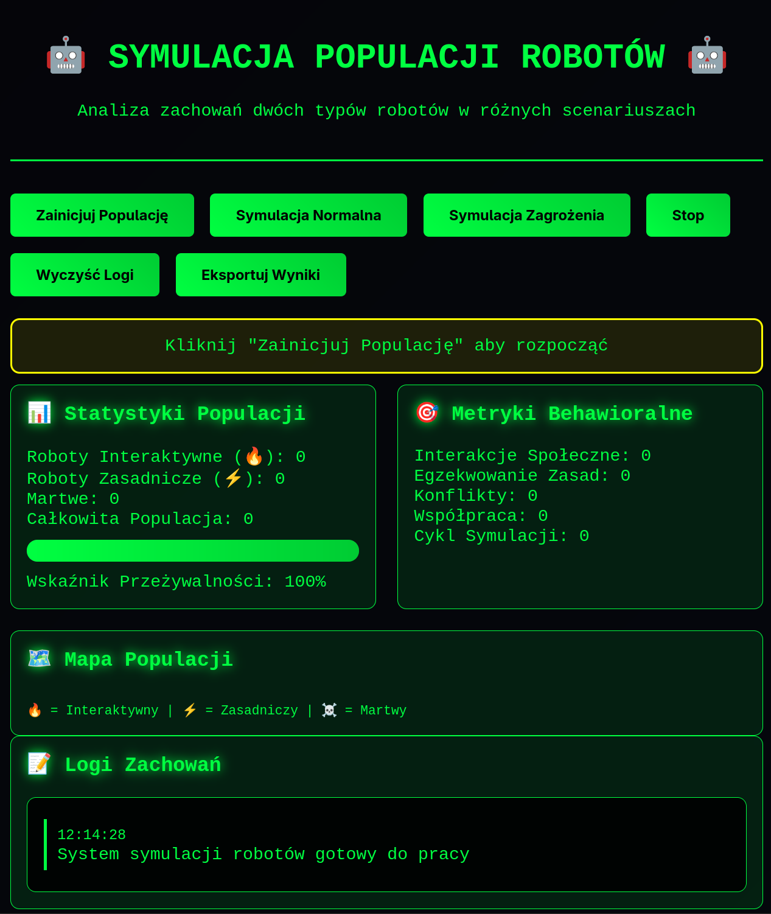
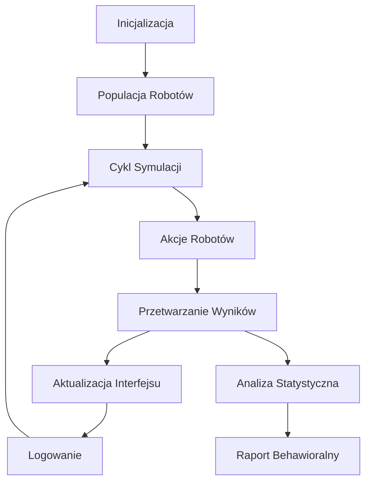

# 🤖 Robot Population Simulation

Zaawansowana symulacja populacji robotów z dwoma typami behawioralnymi, implementująca różnorodne wzorce interakcji społecznych i strategii przetrwania w warunkach normalnych i kryzysowych.

## 📋 Spis Treści

- [Opis Projektu](#opis-projektu)
- [Typy Robotów](#typy-robotów)
- [Funkcjonalności](#funkcjonalności)
- [Instalacja i Uruchomienie](#instalacja-i-uruchomienie)
- [Instrukcja Użytkowania](#instrukcja-użytkowania)
- [Architektura Systemu](#architektura-systemu)
- [Scenariusze Testowe](#scenariusze-testowe)
- [Analiza Wyników](#analiza-wyników)
- [API Referencja](#api-referencja)
- [Rozszerzenia](#rozszerzenia)
- [Licencja](#licencja)

## 🎯 Opis Projektu

Robot Population Simulation to kompleksowy system symulujący zachowania populacji robotów składającej się z dwóch podstawowych typów behawioralnych. Projekt bada interakcje społeczne, strategie przetrwania i adaptację w różnych scenariuszach środowiskowych.

### Cele Projektu

- **Badanie zachowań emergentnych** w populacjach mieszanych
- **Analiza strategii przetrwania** w warunkach zagrożenia
- **Porównanie efektywności** różnych typów behawioralnych
- **Modelowanie interakcji społecznych** w systemach autonomicznych

## 🤖 Typy Robotów

### Robot Interaktywny (🔥)

**Klasa**: `InteractiveRobot`

#### Charakterystyka Behawioralna
- **Priorytet**: Interakcje społeczne i budowanie więzi
- **Empatia**: 50-100 (wysoka wrażliwość na stan innych)
- **Popęd społeczny**: 60-100 (silna potrzeba kontaktu)
- **Strategia**: Współpraca i wzajemne wsparcie

#### Zachowania Normalne
```javascript
// Główne akcje w warunkach standardowych
- cooperate()           // Współpraca zwiększająca zdrowie
- socialize()          // Redukcja stresu przez interakcję
- seekComfort()        // Poszukiwanie wsparcia emocjonalnego
- explore()            // Eksploracja nowych możliwości
```

#### Reakcje na Zagrożenia
```javascript
// Strategie w sytuacjach kryzysowych
- protectOthers()      // Ochrona słabszych kosztem własnego zdrowia
- seekSupport()        // Mobilizacja wsparcia grupowego
- panicFlee()          // Ucieczka w ostateczności
```

### Robot Zasadniczy (⚡)

**Klasa**: `RuleBasedRobot`

#### Charakterystyka Behawioralna
- **Priorytet**: Utrzymanie porządku i egzekwowanie zasad
- **Dyscyplina**: 70-100 (wysoka samokontrola)
- **Dbałość o porządek**: 65-100 (organizacja struktury)
- **Strategia**: Hierarchia i systematyczne działanie

#### Zachowania Normalne
```javascript
// Główne akcje w warunkach standardowych
- enforceOrder()       // Przywracanie stabilności
- establishHierarchy() // Organizacja struktury dowodzenia
- optimizeEfficiency() // Poprawa wydajności grupy
- patrol()             // Monitoring naruszeń porządku
```

#### Reakcje na Zagrożenia
```javascript
// Strategie w sytuacjach kryzysowych
- organizeDefense()    // Skoordynowana obrona grupowa
- coordinateEvacuation() // Uporządkowana ewakuacja
- strategicRetreat()   // Kontrolowane wycofanie
```

## ⚙️ Funkcjonalności

### Główne Możliwości Systemu

1. **Inicjalizacja Populacji**
   - Tworzenie 50 robotów w układzie siatki 10x5
   - Losowy podział na typy behawioralne
   - Parametryzacja cech indywidualnych

2. **Symulacje Scenariuszowe**
   - **Symulacja Normalna**: Standardowe warunki funkcjonowania
   - **Symulacja Zagrożenia**: Ataki drapieżników i sytuacje kryzysowe

3. **Monitoring Real-time**
   - Wizualizacja stanu populacji
   - Śledzenie wskaźników zdrowia, energii i stresu
   - Aktualizacja statystyk behawioralnych

4. **System Logowania**
   - Szczegółowe rejestrowanie wszystkich akcji
   - Kategoryzacja logów (normal, threat, interaction, rule)
   - Timestamping i filtrowanie

5. **Analiza Statystyczna**
   - Porównanie typów behawioralnych
   - Wskaźniki przeżywalności
   - Metryki współpracy i konfliktów

6. **Eksport Danych**
   - Format JSON z pełnymi danymi symulacji
   - Kompatybilność z narzędziami analitycznymi

## 🚀 Instalacja i Uruchomienie

### Wymagania Systemowe

- **Przeglądarka**: Chrome 90+, Firefox 88+, Safari 14+, Edge 90+
- **JavaScript**: ES6+ support
- **Pamięć**: Minimum 512MB RAM dostępnej dla przeglądarki

### Instalacja

1. **Pobierz pliki projektu**:
```bash
git clone https://github.com/your-repo/robot-population-simulation.git
cd robot-population-simulation
```

2. **Uruchom symulację**:
```bash
# Opcja 1: Bezpośrednie otwarcie
open index.html

# Opcja 2: Lokalny serwer (zalecane)
python -m http.server 8000
# Następnie otwórz http://localhost:8000
```

### Konfiguracja Początkowa

```javascript
// Dostosowanie parametrów w pliku konfiguracyjnym
const SIMULATION_CONFIG = {
    POPULATION_SIZE: 50,        // Rozmiar populacji
    GRID_WIDTH: 10,             // Szerokość siatki
    GRID_HEIGHT: 5,             // Wysokość siatki
    CYCLE_DURATION: 1000,       // Czas cyklu (ms)
    MAX_LOGS: 100,              // Maksymalna liczba logów
    AUTO_REPORT_INTERVAL: 10    // Częstotliwość raportów
};
```

## 📖 Instrukcja Użytkowania

### Panel Kontrolny

1. **Zainicjuj Populację** - Tworzy nową populację 50 robotów
2. **Symulacja Normalna** - Uruchamia standardowy scenariusz
3. **Symulacja Zagrożenia** - Aktywuje scenariusz ataków drapieżników
4. **Stop** - Zatrzymuje bieżącą symulację
5. **Wyczyść Logi** - Usuwa historię działań
6. **Eksportuj Wyniki** - Pobiera dane w formacie JSON

### Interpretacja Wizualizacji

#### Siatka Robotów
- **🔥** - Robot Interaktywny (żywy)
- **⚡** - Robot Zasadniczy (żywy)
- **☠️** - Robot martwy

#### Kolory Statusu
- **Pomarańczowy** - Roboty Interaktywne
- **Turkusowy** - Roboty Zasadnicze
- **Szary** - Roboty nieaktywne/martwe

#### Pasek Przeżywalności
- **Zielony** - Wysoki wskaźnik przeżycia (80-100%)
- **Żółty** - Średni wskaźnik przeżycia (50-79%)
- **Czerwony** - Niski wskaźnik przeżycia (0-49%)

### Logi Kolorystyczne

- **Zielony** - Działania normalne
- **Czerwony** - Sytuacje zagrożenia
- **Pomarańczowy** - Interakcje społeczne
- **Turkusowy** - Egzekwowanie zasad

## 🏗️ Architektura Systemu

### Struktura Klas

```
RobotPopulationSimulator
├── Robot (klasa bazowa)
│   ├── InteractiveRobot
│   └── RuleBasedRobot
├── SimulationEngine
├── LoggingSystem
├── StatisticsTracker
└── DataExporter
```

### Przepływ Danych



### Właściwości Robotów

#### Stan Podstawowy
```javascript
{
    id: Number,           // Unikalny identyfikator
    type: String,         // 'interactive' | 'rule-based'
    x: Number,            // Pozycja X (0-9)
    y: Number,            // Pozycja Y (0-4)
    health: Number,       // Zdrowie (0-100)
    energy: Number,       // Energia (0-100)
    stress: Number,       // Poziom stresu (0-100)
    alive: Boolean        // Status życia
}
```

#### Metryki Behawioralne
```javascript
{
    empathy: Number,           // Tylko Interactive (50-100)
    socialDrive: Number,       // Tylko Interactive (60-100)
    discipline: Number,        // Tylko RuleBased (70-100)
    orderMaintenance: Number,  // Tylko RuleBased (65-100)
    cooperationScore: Number,  // Liczba współprac
    conflictScore: Number      // Liczba konfliktów
}
```

## 🧪 Scenariusze Testowe

### Scenariusz 1: Symulacja Normalna

**Opis**: Roboty funkcjonują w standardowych warunkach bez zewnętrznych zagrożeń.

**Oczekiwane zachowania**:
- Roboty Interaktywne: Aktywne socjalizowanie, budowanie więzi
- Roboty Zasadnicze: Organizacja struktury, optymalizacja efektywności

**Metryki sukcesu**:
- Stabilny poziom zdrowia populacji
- Wysokie wskaźniki współpracy
- Niski poziom konfliktów

### Scenariusz 2: Symulacja Zagrożenia

**Opis**: Populacja jest atakowana przez drapieżniki z losowymi interwałami.

**Oczekiwane zachowania**:
- Roboty Interaktywne: Ochrona słabszych, poszukiwanie wsparcia grupowego
- Roboty Zasadnicze: Organizacja obrony, koordynacja ewakuacji

**Metryki sukcesu**:
- Efektywność strategii przetrwania
- Minimalizacja strat w populacji
- Szybkość reakcji na zagrożenia

### Przypadki Testowe

#### Test 1: Porównanie Przeżywalności
```javascript
// Uruchom symulację zagrożenia przez 100 cykli
// Porównaj wskaźniki przeżycia obu typów
expectedSurvivalRate: {
    interactive: 60-80%,
    ruleBased: 70-90%
}
```

#### Test 2: Analiza Współpracy
```javascript
// Uruchom symulację normalną przez 50 cykli
// Zmierz liczbę interakcji współpracy
expectedCooperationRatio: {
    interactive: 3:1,  // 3 współprace na 1 konflikt
    ruleBased: 1:2     // 1 współpraca na 2 egzekwowania zasad
}
```

## 📊 Analiza Wyników

### Automatyczne Raporty

System generuje raporty porównawcze co 10 cykli symulacji:

```
=== RAPORT BEHAWIORALNY (Cykl 50) ===

ROBOTY INTERAKTYWNE:
• Średnie zdrowie: 78.5
• Średni stres: 32.1
• Współpraca: 12.3
• Przeżywalność: 84.2%

ROBOTY ZASADNICZE:
• Średnie zdrowie: 82.7
• Średni stres: 28.9
• Współpraca: 8.7
• Przeżywalność: 91.3%
```

### Kluczowe Wskaźniki KPI

1. **Wskaźnik Przeżywalności** = (Żywe Roboty / Całkowita Populacja) × 100%
2. **Efektywność Współpracy** = Akcje Współpracy / Całkowite Akcje
3. **Poziom Konfliktowości** = Konflikty / (Konflikty + Współpraca)
4. **Stabilność Stresu** = Średni Spadek Stresu / Cykl

### Format Eksportu Danych

```json
{
    "timestamp": "2025-06-04T10:30:00.000Z",
    "scenario": "threat",
    "cycle": 75,
    "population": {
        "total": 50,
        "alive": 42,
        "interactive": 19,
        "ruleBased": 23,
        "dead": 8
    },
    "stats": {
        "socialInteractions": 145,
        "ruleEnforcements": 89,
        "conflicts": 23,
        "cooperations": 67
    },
    "robotDetails": [...],
    "logs": [...]
}
```

## 🔌 API Referencja

### Główne Klasy

#### RobotPopulationSimulator

```javascript
class RobotPopulationSimulator {
    constructor()
    initializePopulation(size: number)
    runSimulationCycle(scenario: string)
    startNormalSimulation()
    startThreatSimulation()
    stopSimulation()
    exportResults()
    analyzeBehavioralDifferences()
}
```

#### Robot (Klasa Bazowa)

```javascript
class Robot {
    constructor(id: number, type: string, x: number, y: number)
    isAlive(): boolean
    takeDamage(amount: number): void
    heal(amount: number): void
    consumeEnergy(amount: number): void
    normalBehavior(population: Robot[]): Action
    threatResponse(population: Robot[], threat: string): Action
}
```

### Typy Akcji

```javascript
interface Action {
    type: 'normal' | 'threat' | 'interaction' | 'rule';
    actor: Robot;
    target?: Robot;
    action: string;
    result: string;
}
```

### Eventy Systemu

```javascript
// Nasłuchiwanie eventów symulacji
simulator.on('cycleComplete', (cycle, stats) => {
    console.log(`Cykl ${cycle} zakończony`, stats);
});

simulator.on('robotDeath', (robot) => {
    console.log(`Robot ${robot.id} został eliminowany`);
});

simulator.on('emergentBehavior', (behavior) => {
    console.log('Wykryto emergentne zachowanie:', behavior);
});
```

## 🔧 Rozszerzenia

### Planowane Funkcjonalności

1. **Nowe Typy Robotów**
   - Robot Hybrydowy (łączący cechy obu typów)
   - Robot Adaptacyjny (zmieniający strategię)

2. **Dodatkowe Scenariusze**
   - Niedobór zasobów
   - Migracja populacji
   - Epidemie cybernetyczne

3. **Ulepszona Analityka**
   - Machine Learning do przewidywania
   - Wizualizacje 3D
   - Analiza sieci społecznych

4. **Integracje**
   - Export do R/Python
   - API dla zewnętrznych narzędzi
   - Baza danych dla długoterminowych badań

### Rozszerzanie Systemu

#### Dodawanie Nowego Typu Robota

```javascript
class CustomRobot extends Robot {
    constructor(id, x, y) {
        super(id, 'custom', x, y);
        this.customProperty = value;
    }
    
    normalBehavior(population) {
        // Implementacja zachowań normalnych
        return action;
    }
    
    threatResponse(population, threat) {
        // Implementacja reakcji na zagrożenia
        return action;
    }
}
```

#### Dodawanie Nowego Scenariusza

```javascript
// W klasie RobotPopulationSimulator
customScenario(population) {
    population.forEach(robot => {
        // Logika scenariusza
        const action = robot.customBehavior(population);
        this.processAction(action);
    });
}
```

## 🐛 Debugging i Rozwiązywanie Problemów

### Częste Problemy

1. **Symulacja się zawiesza**
   - Sprawdź konsole deweloperską (F12)
   - Zrestartuj przez odświeżenie strony

2. **Nieoczekiwane zachowania**
   - Włącz szczegółowe logowanie
   - Sprawdź parametry robotów w eksporcie

3. **Problemy z wydajnością**
   - Zmniejsz rozmiar populacji
   - Zwiększ interwał cykli

### Debugowanie

```javascript
// Włączenie trybu debug
simulator.debugMode = true;

// Szczegółowe logowanie
simulator.verboseLogging = true;

// Inspekcja stanu robota
console.log(simulator.population[0]);
```

## 📜 Licencja

Zobacz plik [LICENSE](LICENSE) dla szczegółów.

## 👥 Autorzy

- **Główny Deweloper**: [Twoje Imię]
- **Konsultant AI**: Claude (Anthropic)

## 🙏 Podziękowania

- Społeczność open source za inspirację
- Badacze sztucznej inteligencji za podstawy teoretyczne
- Beta testerzy za feedback i sugestie

---

**Wersja**: 1.0.0  
**Ostatnia aktualizacja**: Czerwiec 2025  
**Status**: Aktywny rozwój

Dla pytań i zgłaszania problemów, odwiedź [Issues](https://github.com/your-repo/robot-population-simulation/issues)
